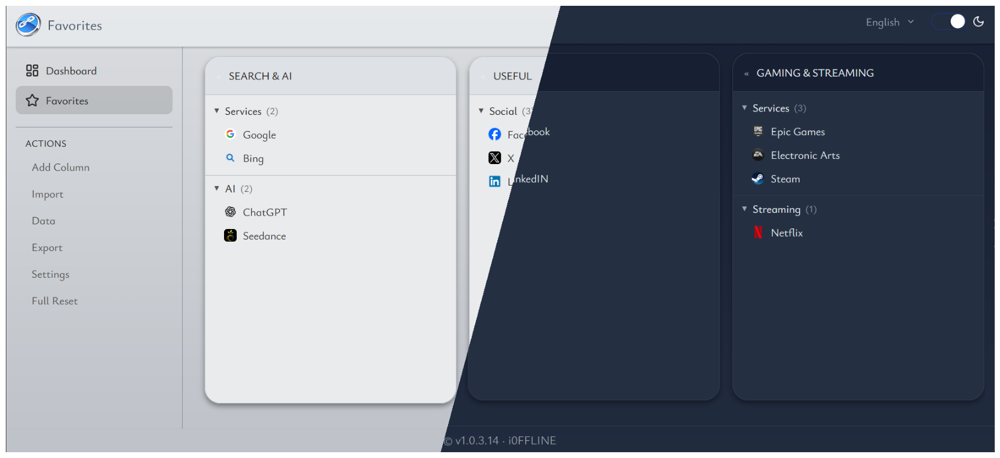
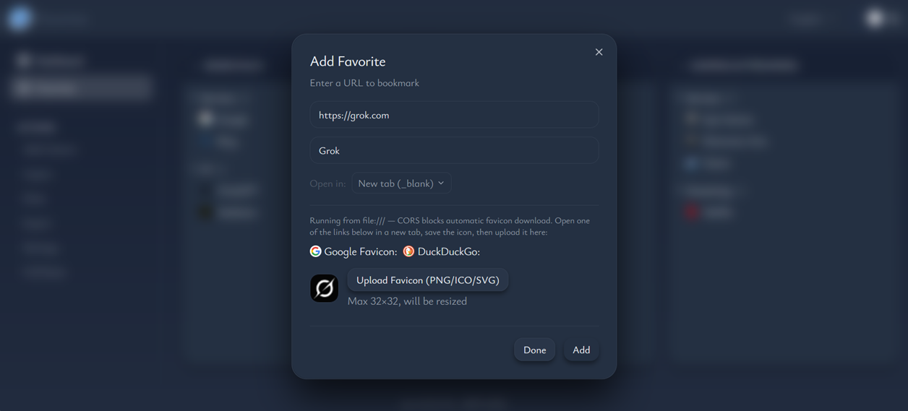

# re-Linked — Your Personal Start Page

**A local-first bookmark manager that turns your saved links into a visual Kanban board.**
No accounts. No cloud. No tracking. Everything lives on your machine as a single `index.html` file.

---

## What is re-Linked?

re-Linked replaces the browser's built-in bookmarks bar with a drag-and-drop Kanban board. Columns, categories, and links are organized exactly the way you want — zero friction, full control.

**Key principles:**

- **Offline-first** — all data stored in your browser's IndexedDB. No server, no sync, no internet required.
- **Portable** — the built app is a single `index.html` file. Copy it anywhere: USB stick, backup drive, email.
- **Private** — nothing leaves your device. Your links, domains, and usage data are yours alone.
- **Customizable** — light/dark themes with 6 accent shades. English and Russian locales.

---

## Features

### Kanban Board

- **Columns** — high-level groups (Work, Personal, Dev Tools, Media…)
- **Categories** — sub-groups inside columns (Frontend, Backend, News, Music…)
- **Favorites** — compact cards with favicon, title, and click counter

### Drag & Drop

- Reorder columns, categories, and favorites by dragging.
- Responsive: horizontal snap-scroll on mobile, wheel-scroll on desktop.

### Import / Export

- Export your board as JSON (full backup or selected categories).
- Import from JSON: merge mode (adds new items, skips duplicates) or replace mode (clears everything first).
- Dry-run preview before importing — see exactly what will change.

### Duplicate Detection

- Adding a link that already exists? The app shows you exactly where the original lives.
- System-wide duplicate highlights: all copies of the same link are visually flagged across the entire board.

### Domain & Link Editor

- Manage domains and links outside the board.
- Search, edit icons (upload from file), edit URLs and titles.
- Cascade delete: removing a domain removes all associated links and favorites.

### Click Counter

- Each favorite tracks how many times you've opened it. Find out what you actually use.

### Favicons

- Auto-fetches website icons via multiple strategies: Google service, direct `/favicon.ico`, HTML parsing.
- Upload custom icons for domains.

### Themes

- Light / Dark mode with 6 accent shades: Slate, Green, Yellow, Red, Purple, Gray.

---

## Installation & Running

### For users

1. Download the latest `re-Linked.zip` from [Releases](https://github.com/i0FFLINE/re-linked/releases).
2. Extract anywhere on your disk.
3. Open `index.html` in your browser. No server, no installation.

Set it as your new-tab page: use a browser extension like "New Tab Redirect" and point it to `file:///path/to/index.html`.

---

## `file://` Limitations

Running as `file:///` imposes browser restrictions:

| Feature            | Status     | Notes                                           |
| ------------------ | ---------- | ----------------------------------------------- |
| IndexedDB          | ✅ Full    | All data stored locally                         |
| Hash-routing       | ✅ Works   | Uses `createWebHashHistory`                     |
| Import/Export JSON | ✅ Works   | File open/download dialogs                      |
| Favicon fetching   | ⚠️ Limited | Cross-origin requests blocked on some browsers  |
| Copy to clipboard  | ⚠️ Limited | Requires user gesture, not all browsers support |
| `window.open()`    | ✅ Works   | Links open in new tabs                          |
| External fonts     | ✅ Works   | Bundled as woff2 in the build                   |

---

## Tech Stack

| Layer    | Technology        |
| -------- | ----------------- |
| Runtime  | Vue 3             |
| Language | TypeScript        |
| Styles   | TailwindCSS       |
| Storage  | IndexedDB         |
| Output   | Single HTML file  |

---

## License

See [LICENSE](LICENSE) for terms.

Third-party licenses are available in [public/licenses/](public/licenses/).
